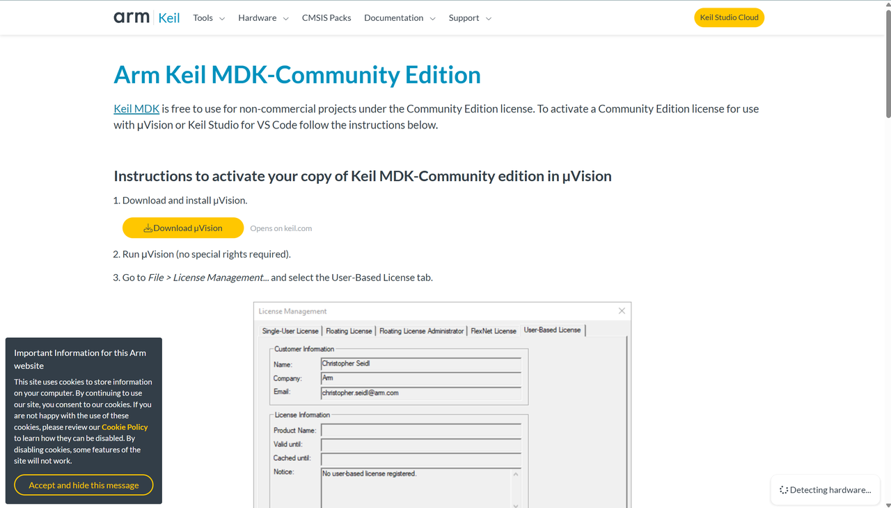
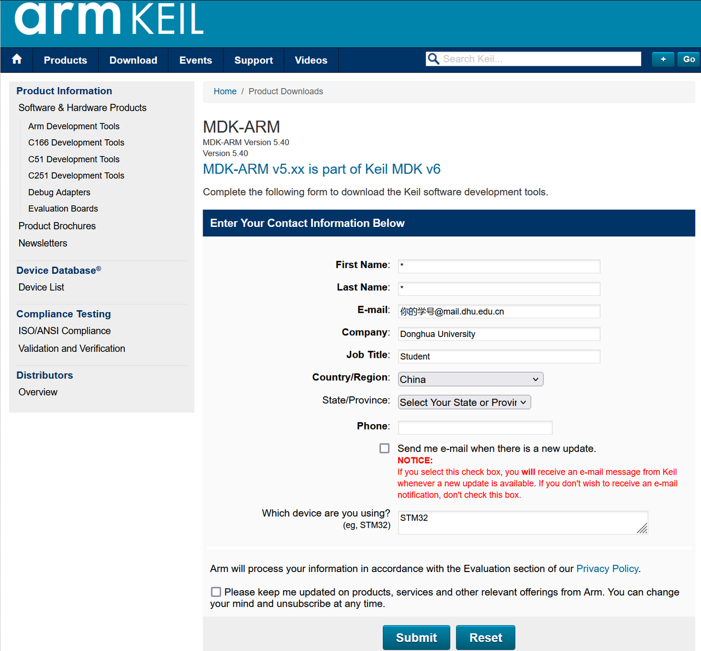
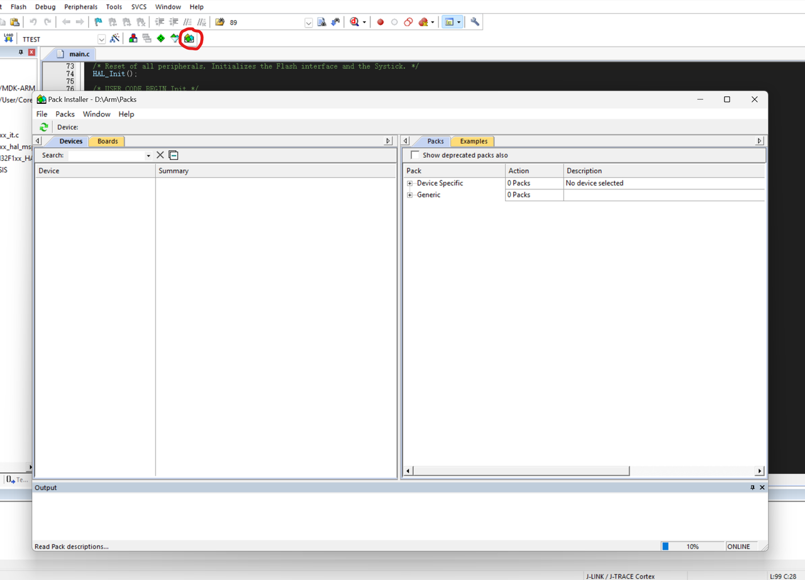
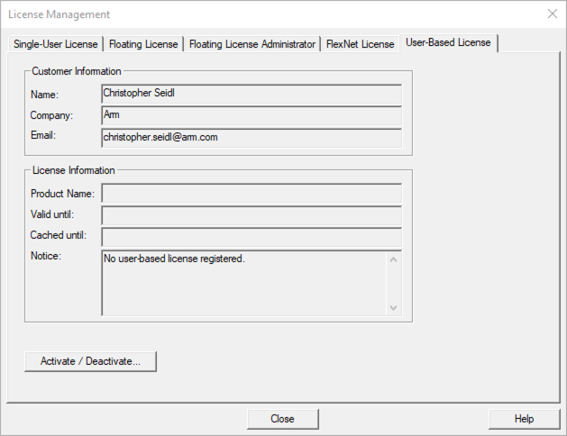
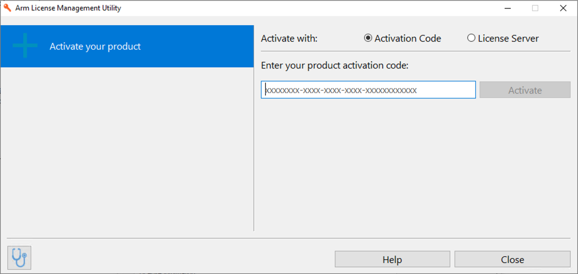
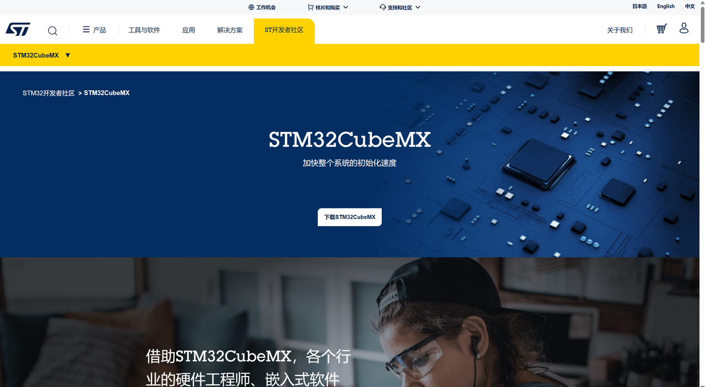
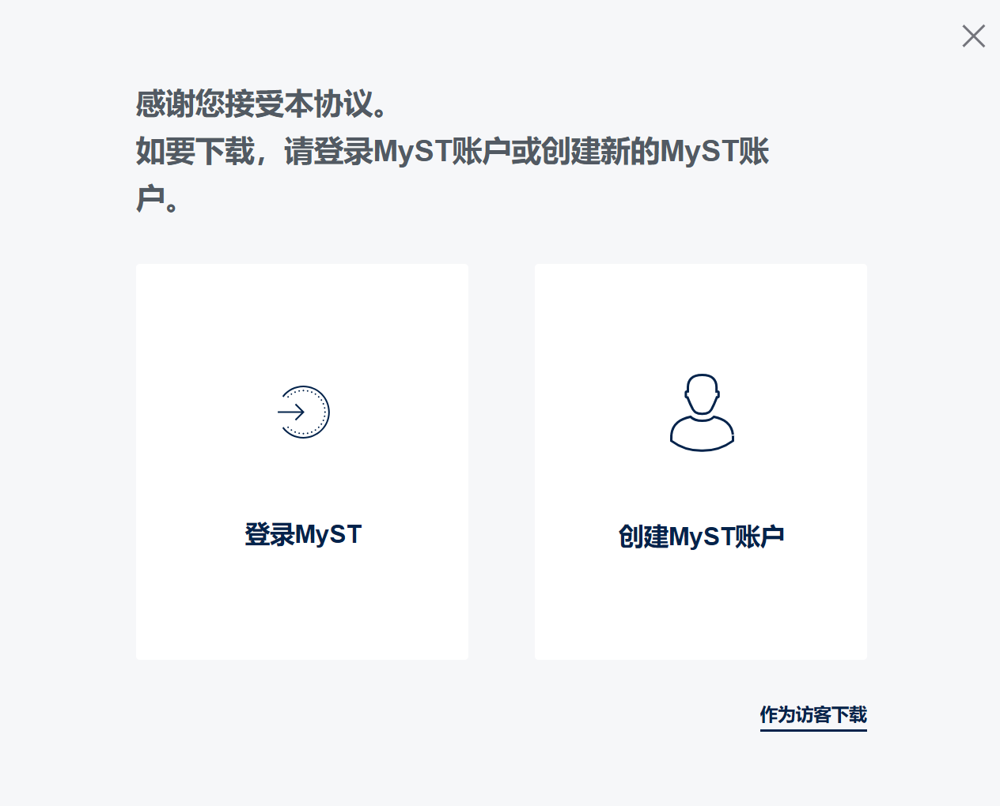
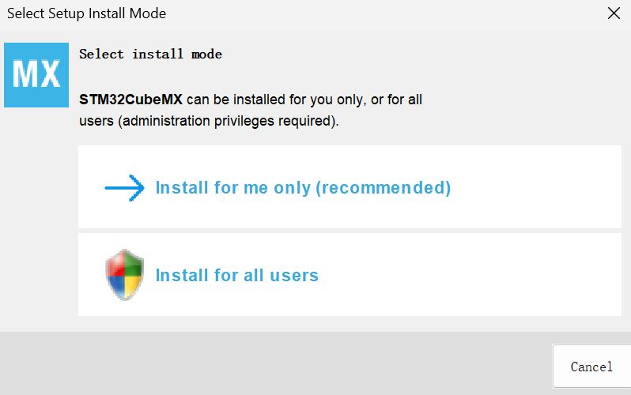
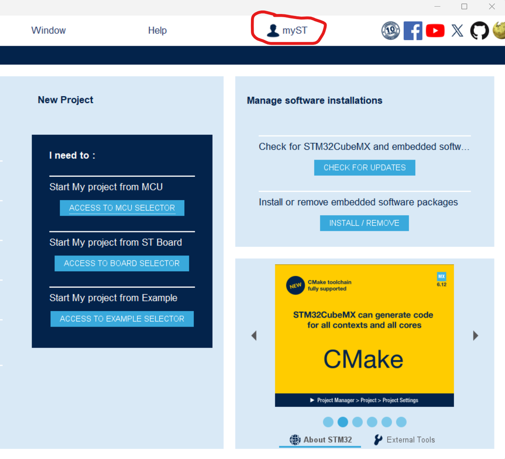

# Software installation and environment configuration

[[中文]](https://docs.dhu-nuedc.top/docs-stm32-zh_CN/introduction/Installation.html)

## Install the Keil MDK-Community Edition

### Download

①Click [https://www.keil.arm.com/mdk-community/](https://www.keil.arm.com/mdk-community/)

②Click the button Download μVision on this page

③Fill in your personal information

④Click the button Submit after filling in the blank

⑤Click the button MDK540.EXE and wait for downloading（Don't close the website！）

###  Install

①Install after downloading the file

Warning: It is not recommended to install software on the Disk C , and ensure that the entire installation path and the path of the pack, does not contain any characters other than numbers, letters, underscores, otherwise the software can not run normally!\

The recommended path:

②Open the software (If the activation fails, open it in administrator mode)

③The software will run

Note: The Pack Installer window may appear when you first open it

You can close this window for now and wait for the next steps to complete before clicking on the button in the red circle above to open the Pack Installer. 

④Go to File > License Management which is in the upper left corner of the interface after opening the software

⑤Select the User-Based License tab

⑥Click Activate / Deactive... and the Arm License Management Utility will open

⑦Click on License Server... in the upper right corner

⑧Enter https://mdk-preview.keil.arm.com as the license server address and click Query

⑨Select Keil MDK Community... and press Activate

⑩The license will be activated

### Install Pack

Download

[Keil.STM32F1xx_DFP.2.4.1.pack](https://www.keil.com/pack/Keil.STM32F1xx_DFP.2.4.1.pack)

double-click to open the installation

Finally don't forget to open the Pack Installer and wait for the installation, when the bottom left corner shows

and when the progress bar in the lower right corner is empty

Then the initial installation is complete and you can close the window

Installation time is long, please wait patiently (because it involves data from servers outside the country, connecting to the campus network in the campus area to download may be faster than the dormitory network speed)

## Install STM32CubeMX

### Register an account

Access to the website[stm32cubemx](https://www.st.com.cn/content/st_com/zh/stm32cubemx.html)

Click to download STM32CubeMX

Select Windows and then choose Download Software in the lower right corner

Choose to create a MyST account (use the school's email address)

Click Register when you have finished filling in the information

### Download and Installation

Wait for the download to finish and unzip

Double click to install, click Install for all users

Also the installation directory is not recommended C drive, and ensure that the entire installation path does not contain any characters other than numbers, letters, underscores, otherwise the software will not run properly!

### Installing the firmware package

Find STM32CubeMX

Open the software and click on MyST at the top to log in

Then click on INSTALL/REMOVE on the right hand side

Select only the first of the STM32F1 and click Install in the bottom right corner (you may need to wait a while before installing)

